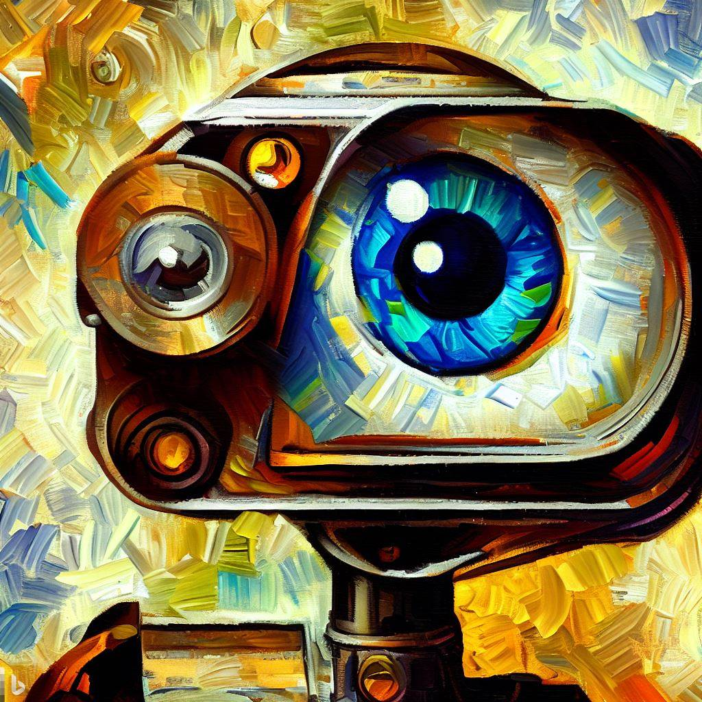

# Computer Vision Projects Repository

   

  

Welcome to my Computer Vision Projects repository! This is a comprehensive collection of various projects that I've undertaken in the field of computer vision, exploring a range of technologies, tools, and techniques.

# About
Computer Vision is a fascinating intersection of image processing, machine learning, and artificial intelligence, allowing machines to understand and interpret the visual world. In this repository, you'll find projects addressing a wide variety of computer vision problems, ranging from basic image manipulation to advanced object detection and recognition.

These projects primarily use OpenCV, a powerful open-source computer vision and machine learning library. Other notable libraries and frameworks, such as TensorFlow, PyTorch, and Caffe, may also be featured.

# Repository Structure
This repository is organized by projects, with each project residing in its own directory. Each project directory will include:

# A brief description of the project.
Source code.
Any necessary data or resources.
A README file explaining how to run the code.
